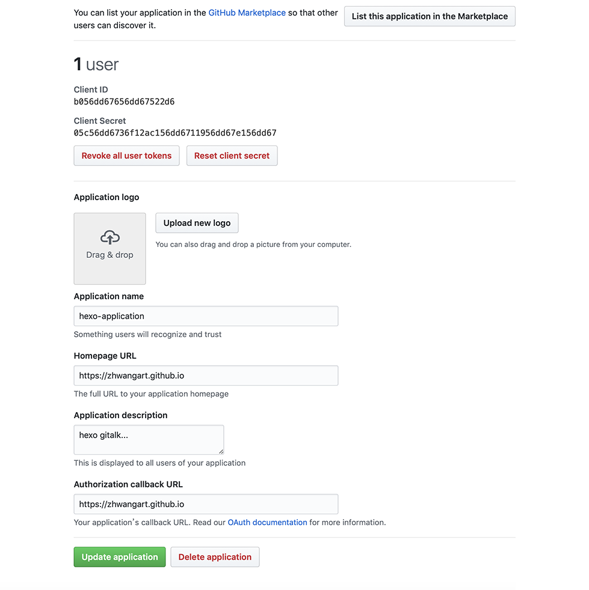

# Gitalk

由于我比较笨还英文严重不好，所以按照 [Gitalk](https://github.com/gitalk/gitalk) 提供的文档给 Hexo 添加评论功能，简直就是不能行！各种报错后，翻看 Issues、Google、百度... 用了一天时间终于 Gitalk 可用了。

这里我分享一下我的添加过程与报错的解决方法，供参考借鉴！


### 申请 GitHub Application

如果有的话在 Github 中 `settings / Developer settings` 选择一个 OAuth App，如果没有 [点击这里申请](https://github.com/settings/applications/new)，当然我第一次使用，显然需要从申请开始。


说明一下：

+ Application name: 这个就是个名称，没有限制，比如：Hexo-application
+ Homepage URL: 网站的主页，我理解就是根目录，比如：[https://zhwangart.github.io](https://zhwangart.github.io)
+ Application description: 描述，非必填，我当时没有写。
+ Authorization callback URL: 回调 url 我理解就是网站的域名，比如：https://zhwangart.github.io

然后申请成功后，就看到有了 Client ID 与 Client Secret 的一个页面，页面下边就是申请刚填写的的信息，均可以再次编辑！ 只有 Client ID 与 Client Secret 是在配置 Hexo 的时候需要用。



看见好多网友做截图时候把 Client ID 与 Client Secret 打码，我有一种木有必要的感觉...

### 在 Hexo 中引入 Gitalk

这个看 [Gitalk](https://github.com/gitalk/gitalk) 里面的引入方法就可以了！

``` xml
<link rel="stylesheet" href="https://unpkg.com/gitalk/dist/gitalk.css">
<script src="https://unpkg.com/gitalk/dist/gitalk.min.js"></script>
```

### 用法

这个一定要**细致**